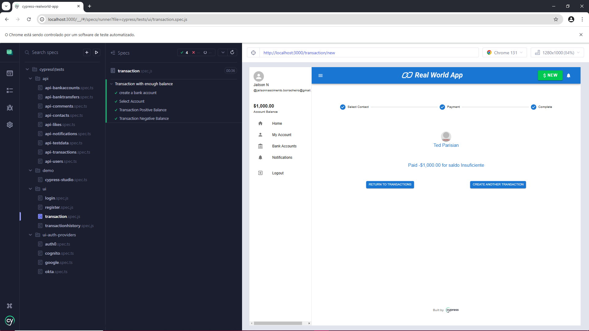

# Automação Cypress JavaScript Orange HRM com CI



Automação E2E com Cypress para o sistema RWA app, utilizando a arquitetura Page Objects. Testes implementados para os módulos Login, Registro, Transações Financeiras com saldo Positivo e saldo Negativo e verificação de histórico de transações realizadas com foco em escalabilidade e manutenção fácil. O projeto demonstra boas práticas em automação de testes e estruturas reutilizáveis, garantindo eficiência e qualidade.

## Como acessar os testes e pages Objects neste projeto** 

> As páginas estão localizadas com o nome **"pages"** e os **specs** estão localizados na pasta **tests** dentro da subpasta **"ui"**


## Pré-requisitos

Para rodar este projeto, você precisará das seguintes ferramentas instaladas:

- [Node.js](https://nodejs.org/) Clique para fazer o download 
- [Yarn Classic](https://classic.yarnpkg.com/lang/en/) 

  

> **💡 NOTA:**
>   Yarn Modern
>   Este projeto não é compatível com o Yarn Modern (versão 2 e posteriores).


## ⚙️ Installar

> **💡 NOTA:** È necessário fazer o registro antes de rodar a automação no site a baixo.
>
>**[Clique aqui para realizar registro, antes de rodar a automação ](http://localhost:3000/signup)**
> 
>## Use as Informações abaixo para o registro.
> 
>Caso use outras informações a automação não funcionará ,outros dados requisitados pode ser colocados aleatóriamente**
>


**1.** **E-mail**
```bash
jailsonnascimento.borracheiro@gmail.com
```
**2.** **Senha**

```bash
1234
```

### Instalação do Yarn Classic

Caso você ainda não tenha o Yarn Classic instalado, siga os passos abaixo:

**1.** **Certifique-se de que o **Node.js** está instalado no seu sistema. Você pode verificar a versão com o seguinte comando:**

   ```bash
   node -v
   ```

**2.** **Instale o Yarn Classic : Se você tiver o recurso experimental Corepack do Node.js habilitado, você deve pular a etapa npm install yarn@latest -g para instalar o Yarn Classic globalmente. O projeto RWA é configurado localmente para Corepack usar Yarn Classic (versão 1).**

  ```bash
npm install yarn@latest -g
```

**3.** **Clone o repositório na sua maquina 🖥️**

```bash
git clone  https://github.com/ElizabethGomes-QAEngineer/cypress-realworld-app.git
```

**4.** **Navegue até o diretório do projeto 📂**

```bash
cd cypress-realworld-app
````

**5.** **Instale as dependências do projeto 📦**

```bash
npm install chance
```
**6.** **Instale yarn no projeto 📦**

```bash
yarn
```
**7.** **Instale yarn dev no projeto 📦**
```bash
yarn dev
```

**8.** **Execute o Cypress para rodar os testes 🚀**

```bash
yarn cypress:open
````


> Após automação realizada com sucesso
> **💡 NOTA:** **Para acessar CI click na branch " ci-last " após click em action**
>
